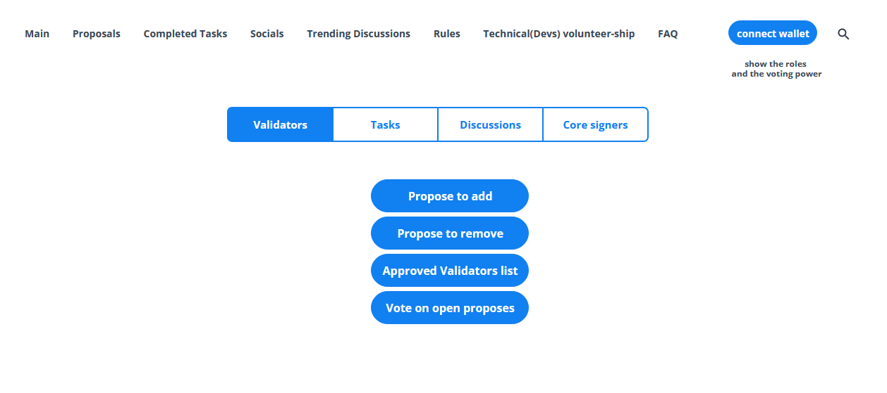
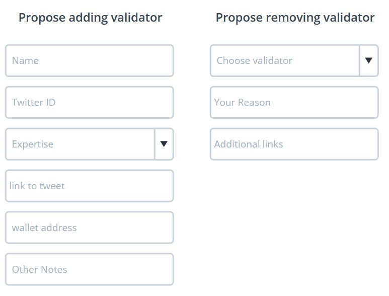
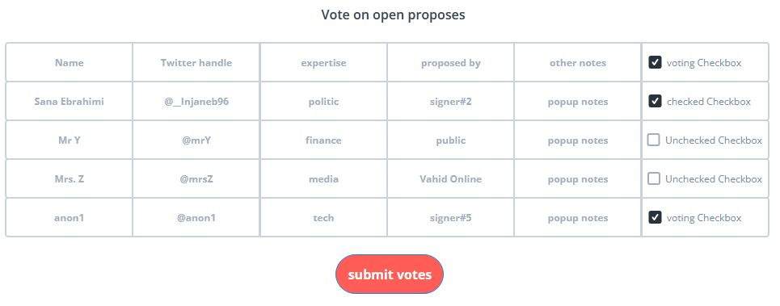
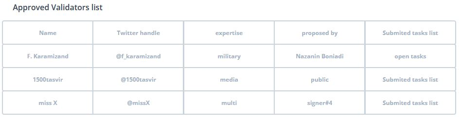
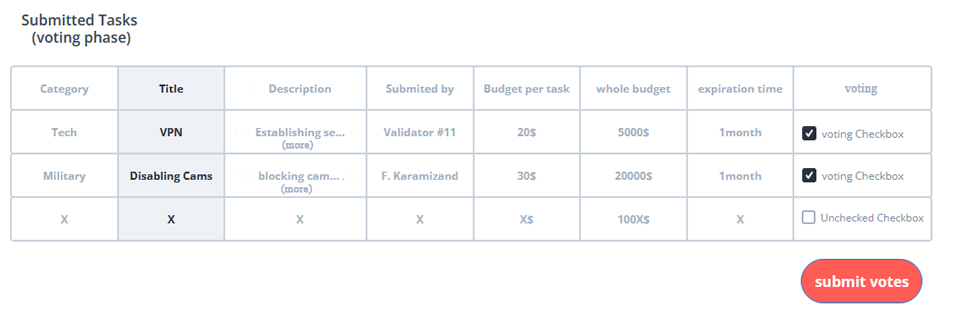
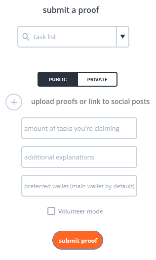
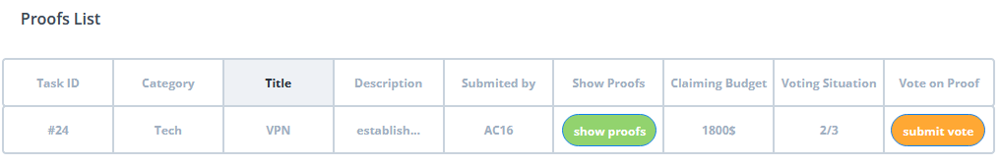

###  تشریح نحوه کار و زمانبندی فازهای مختلف قبل و پس از عملیاتی شدن:

#### فاز اول:

- انتشار وایت‌پیپر و لایت‌پیپر پلتفر

- باز کردن تاپیک‌های کلیدی در [ فروم های رسمی](https://github.com/irandao/cordination/discussions/) پس از 7روز

- انتخاب 7گرداننده مرکزی (همانطور که [ توضیح داده شده](/content/management.md) شد، مهمترین پیش‌نیاز شروع پلتفرم)

- پیشنهاد و داوطلب شدن ولیدیتورها

- گردآوری اولیه تسک‌ها (جمع‌آوری تسکهایی که تاکنون در فضای مجازی پرطرفدار بوده)

-  عضو شدن به تیم فنی و انجام تسکهای مورد نیاز

- بررسی امینی کد های قرارداد هوشمند

- تبلیغات و رسانه

**انتشار کدهای نهایی ورژن اول قرارداد هوشمند (با توجه به بازخوردها پس از انتشار داکیومنت اولیه، اصلاحات و تغییرات نهایی روی قرارداد انجام شده سپس کدها جهت بررسی عموم و آدیت عمومی در گیتهاب مجموعه منتشر میشود)**

 
 

#### فاز یک و نیم: (روز بیستم)

- انتخاب 7امضا کننده از بین داوطلبینی که طبق نظرات و رای‌گیری در شبکه‌‌هاای اجتماعی بیشترین اقبال عمومی را در نظر عموم دارند

 
 

#### فاز دوم: (ده روز پس از فاز یک و نیم)

- بارگذاری قرارداد هوشمند و نسخه اولیه پلتفرم با ثبت آدرسهای 7امضاکننده اصلی

- پس از اجرایی شدن فاز دوم، مسیرهای دونیشن و جذب سرمایه فعال شده

- همینطور گردانندگان اصلی و دارندگان توکن حاکمیتی توانایی ثبت و رای‌گیری جهت اضافه شدن ولیدیتورهای داوطلب را پیدا میکنند.

در این مرحله پس از اتصال کیف‌پول به سایت، رول‌های فرد و قدرت رای‌دهی او بر حسب توکن‌های موجود در کیف‌پول او نمایش داده شده.
 
و تونایی فعالیت در بخشهای مختلف سایت را پیدا میکند:

 

 

#### فاز سوم: (همزمان با فاز دو)

**پیشنهاد و انتخاب ولیدیتورهای منتخب**

 

 

 

#### فاز چهارم: تعریف تسکها در پلتفرم

ولیدیتورها با توجه به رای‌گیری اولیه انجام شده در فروم‌های ایران دائو تسکهای پرطرفدار را شناخته. سپس به صلاحدید خود، اقدام به ثبت تسک‌ها با فرمت مشخص‌ شده درپلتفرم کرده. در صورت که حداقل آرای مورد نظر را بیاورد، تایید شده و آماده‌ی انجام شدن و ثبت اثبات قرار میگیرد

در ورژن ابتدایی میزان بودجه و تعداد تکرار مورد نیاز یک تسک با توجه به نظر ولیدیتورثبت شده. حداکثر بودجه قابل انتضاب به یک تسک برابر با 5درصد خزانه میباشد (این محدودیت برای تسک‌های تعریف شده توسط 7امضاکننده اصلی صادق نبوده). اما در آپدیت‌های بعدی به سمت پیاده‌سازی کوادراتیک‌فاندینگ پیش رفته تا بودجه هر تسک به تناسب با تعداد حامی مستقیم یا رای دهنده به آن تعیین شود. آپدیت کوادراتیک فاندینگ سبب عدم تمرکز بیشتر میشود زیرا محدودیت ثبت تسک که تنها برای ولیدیتورهاست، میتواند برداشته شود. در ضورت آپدیت مذکور، زمانبندی پخش دارایی‌ها به صورت دوره‌ای و epoch های تعریف شده میباشد

برای نهایی شدن یک تسک که توسط ولیدیتور ثبت میشود نیاز به کسب حداقل آرا بوده.

حداقل آرای مورد نیاز:

- تایید 5ولیدیتور

- تایید 30درصد توکن هولدر

- ترکیبی از دو گزاره بالا با تناسب تعریف شده

تمام افراد توانایی دیدن لیست تسکهای تایید شده و در انتظار تایید را دارند.

 

#### فاز پنجم

فعالین باید پس از تایید تسکها با توجه به شرایط و جزییات اجرایی تعریف شده در تسک، اقدام به تکمیل تسک و بارگذاری اثبات آن کنند. اثبات تسک با توجه به نوع تسک و صلاحدید فعال مربوطه میتواند به صورت پابلیک (مثلاً اشتراک‌گذاری  لینک پست توییتری که توانایی اثبات تکمیل تسک و پوشش حداقل جزییات نعریف شده در تسک برای صحت‌سنجی انجام آن را داشته) و یا به صورت خصوصی و از طریق ارتباط رمزنگاری شده بدون ردیابی دیتای شخصی، برای یکی از ولیدیتورها ارسال شده و ولیدیتور در صورت تایید، اثبات را از طرف کاربر ثبت کند.

پس از بارگذاری اثبات، ولیدیتورها باید رای تایید دهند. (تعداد ولیدیتور مورد نیاز بر حسب رقم تسک تعیین شده). اگر به تایید ولیدیتورها برسد و تعداد کافی ولیدیتور تراکنش تایید را امضا کند، هزینه توافق شده به همراه مقداری توکن حاکمیتی پلتفرم و مقدار کمی اتریوم (برای پوشش گس فی مورد نیاز جهت جابجایی توکن‌ها یا ثبت اثبات بعدی) به والت فعال واریز میشود. اگر حالت داوطلبانه فعال شده باشد تنها توکن حاکمیت و اتر برای فعال واریز شده.

همانطور که در بخش مربوط به فعالین توضیح داده شد، در صورتی که تا قبل از ددلاین، افراد بیشتری از ظرفیت و بودجه‌ی تعیین شده اقدام به ثبت پروف کنند و مورد تایید قرار بگیرد، تنها توکن حاکمیتی و اتر برایشان واریز میشود. این ضعف در آپدیت بعدی و پیاده‌سازی scoring system تا حد بسیار زیادی از بین رفته زیرا در آن حالت امکان ذخیره تسک قبل از انجام میسر شده. در ابتدا امکان پیاده‌سازی این روش وجود ندارد زیرا فعالین رزومه و پیشینه فعالیت نداشته و دیتایی برای مدیریت عملکرد آنها موجود نمیباشد.

امیدواریم که مسیر انقلاب آنقدر طول نکشد که به آپدیت private scoring system و private task pick برسد اما ترکیب این دو باعث افزایش چشمگیر حریم خصوصی شده و میتواند برگ برنده پلتفرم ENDGAME باشد.

 

[ بعدی](/content/privacy.md)
 

[ قبلی](/content/management.md)

